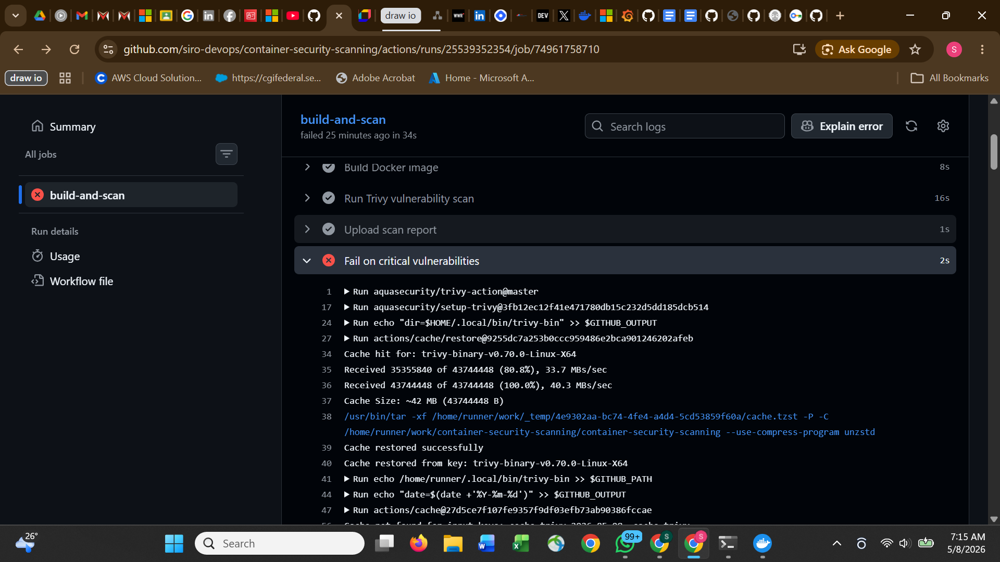
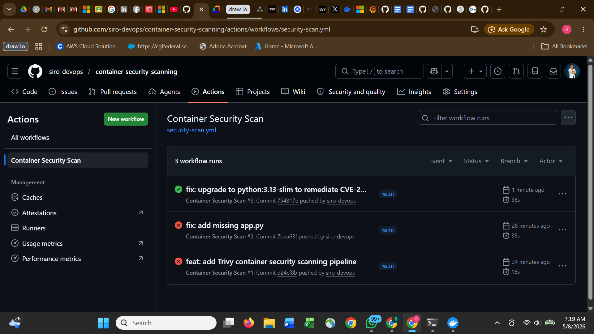

# Container Security Scanning with Trivy

Every Docker image is automatically scanned for CVEs before it can deploy.
Critical vulnerabilities block the pipeline. No vulnerable images reach production.

## How it works

1. Code is pushed to GitHub
2. GitHub Actions builds the Docker image
3. Trivy scans the image for known CVEs
4. HIGH and CRITICAL vulnerabilities are reported as a downloadable artifact
5. Any CRITICAL vulnerability fails the pipeline and blocks deployment

## What was proved

| Test | Result |
|---|---|
| Vulnerable image (python:3.9-slim) | Trivy detected CVE-2026-31789 (OpenSSL heap buffer overflow), pipeline blocked |
| Remediated image (python:3.13-slim) | Zero critical vulnerabilities, pipeline passed |
| Scan report uploaded | Trivy report available as GitHub Actions artifact on every run |

## Evidence

### Critical CVE detected - pipeline blocked

### Vulnerability remediated - pipeline passes

## Pipeline structure

.github/workflows/security-scan.yml

Step 1 - Checkout code
Step 2 - Build Docker image
Step 3 - Trivy scan (report uploaded as artifact, exit-code 0)
Step 4 - Trivy scan (blocks on CRITICAL, exit-code 1)

## Key concepts demonstrated

Shift-left security -- vulnerabilities caught at build time, not in production.

Severity gating -- CRITICAL CVEs block deployment automatically. HIGH CVEs are reported but do not block.

Artifact upload -- every scan produces a downloadable report for audit and compliance purposes.

Remediation verification -- after fixing the base image, the pipeline confirms zero critical vulnerabilities before allowing deployment.

## Stack

Trivy, GitHub Actions, Docker, Python, Flask

## What I would add next

- Scan infrastructure as code with trivy config .
- Add SARIF output format to show CVEs in GitHub Security tab
- Scan on pull request and post results as a PR comment
- Set up Dependabot to automatically open PRs for vulnerable dependencies
- Add OPA policy to enforce approved base images only
